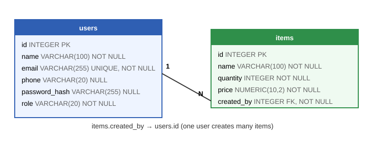
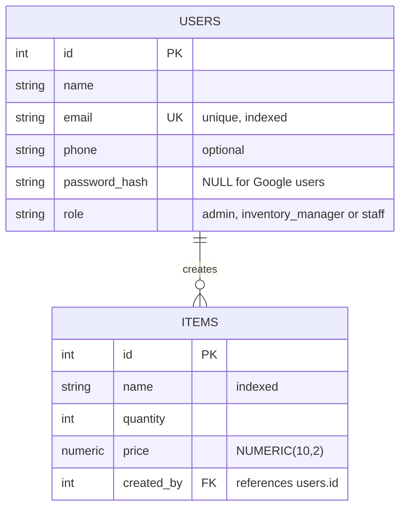

# Database Design (PostgreSQL 15)

Tables are created and versioned with **Alembic** migrations (`alembic/versions/`). `alembic upgrade head` runs automatically when the Docker container starts.

## ERD


The same diagram as text (Mermaid, shown by GitHub):



## Table definitions

### `users`
| Column | Type | Constraints |
| :--- | :--- | :--- |
| id | INTEGER | PRIMARY KEY (auto number) |
| name | VARCHAR(100) | NOT NULL |
| email | VARCHAR(255) | NOT NULL, UNIQUE, indexed |
| phone | VARCHAR(20) | NULL allowed (optional) |
| password_hash | VARCHAR(255) | NULL allowed (Google users have no password) |
| role | VARCHAR(20) | NOT NULL (`admin`, `inventory_manager` or `staff`; the app sets `staff` on signup) |

### `items`
| Column | Type | Constraints |
| :--- | :--- | :--- |
| id | INTEGER | PRIMARY KEY (auto number) |
| name | VARCHAR(100) | NOT NULL, indexed |
| quantity | INTEGER | NOT NULL |
| price | NUMERIC(10,2) | NOT NULL (exact decimal, so money has no rounding errors) |
| created_by | INTEGER | NOT NULL, FOREIGN KEY → `users.id` |

## Relationships
- One `user` creates many `items` (`items.created_by → users.id`, one-to-many).
- Every item belongs to exactly one user. A user who created items cannot be deleted from the database (the foreign key protects the items).

## Keys
- Primary keys: `users.id`, `items.id`
- Foreign key: `items.created_by → users.id`
- Unique key: `users.email`

## Looking at the data
With psql:
```bash
docker compose exec db psql -U postgres -d inventory_db -c "SELECT id, name, email, role FROM users;"
docker compose exec db psql -U postgres -d inventory_db -c "SELECT * FROM items;"
```