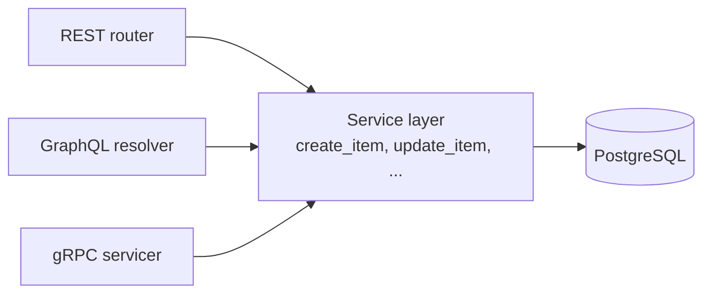

# GraphQL Design (specification only)

Same application, same rules and same results as the REST API (`docs/REST_API_Design.md`). Only the way of asking is different.

- One endpoint: `POST /graphql` (one URL, the operation name decides what happens)
- Auth: the **same JWT** as REST: `Authorization: Bearer <access_token>`
- Signup, login and googleLogin are public. Everything else needs a token.
- The role is read from the database (not from the token), exactly like REST.

## 1. How it works (same logic as REST)



The business rules (any logged-in user can update items, only admin/manager can delete, the role comes from the database, 409 on a duplicate email) are the same in REST, GraphQL and gRPC.

## 2. Schema

```graphql
enum Role { ADMIN INVENTORY_MANAGER STAFF }
enum AssignableRole { INVENTORY_MANAGER STAFF }     # nobody can be made ADMIN (same as REST)

type User {
  id: ID!
  name: String!
  email: String!
  phone: String                  # optional
  role: Role!
}

type ItemCreator {               # only public fields: email/phone stay admin-only (like GET /users)
  id: ID!
  name: String!
}

type Item {
  id: ID!
  name: String!
  quantity: Int!                 # 0 = out of stock
  price: Float!                  # NUMERIC(10,2) in PostgreSQL, 2 decimals (same as REST)
  createdBy: ID!                 # users.id, same as REST "created_by"
  creator: ItemCreator!          # GraphQL extra: get the creator's name in the same call
}

type ItemPage { page: Int!  limit: Int!  total: Int!  items: [Item!]! }

type AuthPayload { accessToken: String!  tokenType: String!  role: Role! }

input SignupInput {
  name: String!                  # 1-100 chars, spaces at the ends removed
  email: String!                 # valid email
  phone: String                  # 7-15 digits, optional leading +
  password: String!              # 8-64 chars, max 72 bytes
}

input ItemInput {
  name: String!                  # 1-100 chars
  quantity: Int!                 # >= 0
  price: Float!                  # >= 0.01 and <= 99999999.99
}

type Query {
  health: String!                                              # public
  item(id: ID!): Item!                                         # logged in
  items(page: Int = 1, limit: Int = 10, search: String): ItemPage!   # logged in, page >= 1, limit 1-100
  users: [User!]!                                              # admin only
}

type Mutation {
  signup(input: SignupInput!): User!                           # public, role = STAFF
  login(email: String!, password: String!): AuthPayload!       # public
  googleLogin(idToken: String!): AuthPayload!                  # public
  createItem(input: ItemInput!): Item!                         # logged in, createdBy = token user
  updateItem(id: ID!, input: ItemInput!): Item!                # any logged-in user
  deleteItem(id: ID!): Boolean!                                # admin or inventory_manager
  updateUserRole(id: ID!, role: AssignableRole!): User!        # admin only
}
```

## 3. Rules (identical to REST)

| Rule | Where it is enforced |
| :--- | :--- |
| Token missing / bad / expired / user deleted | `UNAUTHENTICATED` (REST 401) |
| Role not allowed (staff deleting, non-admin listing users, staff editing another user's item) | `FORBIDDEN` (REST 403) |
| Item or user not found | `NOT_FOUND` (REST 404) |
| Email already registered, or Google email has a password account | `CONFLICT` (REST 409) |
| Invalid input (empty name, quantity < 0, price < 0.01, bad email, short password, limit > 100) | `BAD_USER_INPUT` (REST 422) |
| Changing the admin's role | `BAD_REQUEST` (REST 400) |
| Google login not configured | `SERVICE_UNAVAILABLE` (REST 503) |
| Signup starts the background task `send_welcome_message` | same service function as REST |
| `created_by` is taken from the token, never from the input | same service function as REST |

## 4. Errors
GraphQL answers with **HTTP 200** and an `errors` list. The code is in `extensions.code`:
```json
{ "data": null,
  "errors": [ { "message": "Item not found", "path": ["item"], "extensions": { "code": "NOT_FOUND" } } ] }
```
(Only a request that is not valid GraphQL at all gets HTTP 400.)

## 5. Examples

Login, then call with the token:
```graphql
mutation { login(email: "user@example.com", password: "password123") { accessToken role } }
```
```graphql
query {
  items(page: 1, limit: 5, search: "mouse") {
    total
    items { id name quantity price creator { name } }   # REST needs a second call for the creator
  }
}
```
```graphql
mutation { createItem(input: { name: "Keyboard", quantity: 10, price: 49.99 }) { id createdBy } }
mutation { deleteItem(id: 1) }                           # true, or FORBIDDEN for staff
```

## 6. REST ↔ GraphQL
| REST | GraphQL | REST success |
| :--- | :--- | :--- |
| `GET /health` | `query health` | 200 |
| `POST /auth/signup` | `mutation signup` | 201 |
| `POST /auth/login` | `mutation login` | 200 |
| `POST /auth/google` | `mutation googleLogin` | 200 |
| `POST /items` | `mutation createItem` | 201 |
| `GET /items?page&limit&search` | `query items` | 200 |
| `GET /items/{id}` | `query item` | 200 |
| `PUT /items/{id}` | `mutation updateItem` | 200 |
| `DELETE /items/{id}` | `mutation deleteItem` | 204 (here `true`) |
| `GET /users` | `query users` | 200 |
| `PATCH /users/{id}/role` | `mutation updateUserRole` | 200 |

## 7. If it were built
`strawberry-graphql` mounted in FastAPI at `/graphql`; the JWT check is the same `get_current_user` code, put in the GraphQL context; permission classes `IsAuthenticated` and `HasRole("admin")` replace `require_roles`. Not implemented, as the assignment asks for the design only.