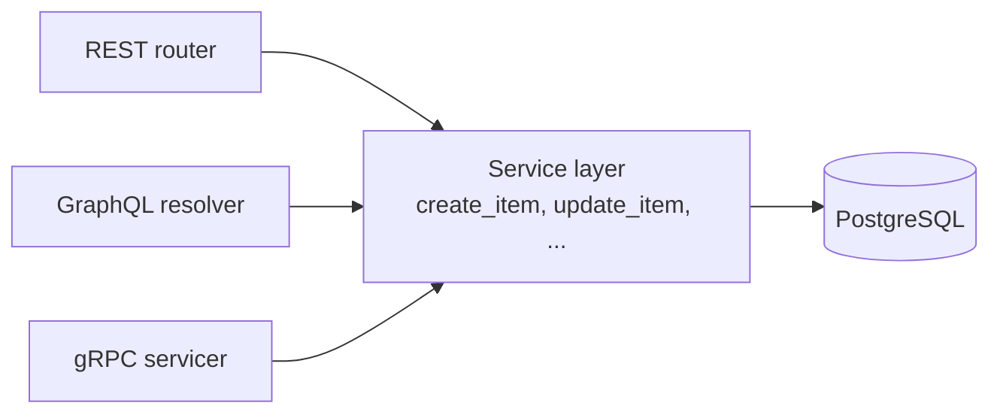

# gRPC Design (specification only)

Same application, same rules and same results as the REST API (`docs/REST_API_Design.md`). Only the way of calling is different: binary Protocol Buffers over HTTP/2, meant for service-to-service calls.

- File: `inventory.proto` (proto3) · server port `50051`
- Auth: the **same JWT** in call metadata: `authorization: Bearer <access_token>`
- Public calls: `Signup`, `Login`, `GoogleLogin`, `Health`. Everything else needs a token.
- A server **interceptor** checks the token and loads the user from the database (role comes from the DB, not the token), like `get_current_user` in REST.

## 1. How it works (same logic as REST)



The business rules live **once** in a service layer. The gRPC servicer only converts the proto message into a service call and converts the error into a gRPC status. So gRPC cannot behave differently from REST.

## 2. inventory.proto

```proto
syntax = "proto3";

package inventory.v1;

import "google/protobuf/empty.proto";

enum Role {
  ROLE_UNSPECIFIED = 0;
  ROLE_ADMIN = 1;
  ROLE_INVENTORY_MANAGER = 2;
  ROLE_STAFF = 3;
}

message User {
  int32 id = 1;
  string name = 2;
  string email = 3;
  optional string phone = 4;       // optional: "not set" is different from ""
  Role role = 5;
}

message Item {
  int32 id = 1;
  string name = 2;
  int32 quantity = 3;              // >= 0, 0 = out of stock
  double price = 4;                // NUMERIC(10,2) in PostgreSQL, 2 decimals (same as REST)
  int32 created_by = 5;            // users.id
}

// ---- Auth ----
message SignupRequest {
  string name = 1;                 // 1-100 chars, spaces at the ends removed
  string email = 2;                // valid email
  optional string phone = 3;       // 7-15 digits, optional leading +
  string password = 4;             // 8-64 chars, max 72 bytes
}
message LoginRequest       { string email = 1; string password = 2; }
message GoogleLoginRequest { string id_token = 1; }
message TokenResponse      { string access_token = 1; string token_type = 2; Role role = 3; }

// ---- Items ----
message CreateItemRequest { string name = 1; int32 quantity = 2; double price = 3; }   // price 0.01 - 99999999.99
message GetItemRequest    { int32 id = 1; }
message UpdateItemRequest { int32 id = 1; string name = 2; int32 quantity = 3; double price = 4; }
message DeleteItemRequest { int32 id = 1; }

message ListItemsRequest {
  int32 page = 1;                  // 0 means "not set" -> 1, must be >= 1
  int32 limit = 2;                 // 0 means "not set" -> 10, max 100
  optional string search = 3;      // part of the name, not case sensitive
}
message ListItemsResponse {
  int32 page = 1;
  int32 limit = 2;
  int32 total = 3;
  repeated Item items = 4;
}

// ---- Users (admin only) ----
enum AssignableRole {
  ASSIGNABLE_ROLE_UNSPECIFIED = 0;
  ASSIGNABLE_ROLE_INVENTORY_MANAGER = 1;   // nobody can be made admin (same as REST)
  ASSIGNABLE_ROLE_STAFF = 2;
}
message ListUsersResponse     { repeated User users = 1; }
message UpdateUserRoleRequest { int32 id = 1; AssignableRole role = 2; }   // UNSPECIFIED -> INVALID_ARGUMENT

message HealthResponse { string status = 1; }

// ---- Services ----
service HealthService {
  rpc Check (google.protobuf.Empty) returns (HealthResponse);                  // public
}

service AuthService {                                                          // all public
  rpc Signup (SignupRequest) returns (User);
  rpc Login (LoginRequest) returns (TokenResponse);
  rpc GoogleLogin (GoogleLoginRequest) returns (TokenResponse);
}

service InventoryService {                                                     // logged in
  rpc CreateItem (CreateItemRequest) returns (Item);                           // created_by = token user
  rpc GetItem (GetItemRequest) returns (Item);
  rpc ListItems (ListItemsRequest) returns (ListItemsResponse);
  rpc UpdateItem (UpdateItemRequest) returns (Item);                           // staff: own items only
  rpc DeleteItem (DeleteItemRequest) returns (google.protobuf.Empty);          // admin or inventory_manager
}

service UserService {                                                          // admin only
  rpc ListUsers (google.protobuf.Empty) returns (ListUsersResponse);
  rpc UpdateUserRole (UpdateUserRoleRequest) returns (User);
}
```

## 3. Rules and error mapping (identical to REST)

| REST | gRPC status | When |
| :--- | :--- | :--- |
| 400 | `FAILED_PRECONDITION` | Changing the admin's role |
| 401 | `UNAUTHENTICATED` | No token, bad or expired token, user deleted, wrong login, invalid Google token |
| 403 | `PERMISSION_DENIED` | Role not allowed (staff deleting, non-admin `ListUsers`, staff editing another user's item) |
| 404 | `NOT_FOUND` | Item or user not found |
| 409 | `ALREADY_EXISTS` | Email already registered, or Google email has a password account |
| 422 | `INVALID_ARGUMENT` | Empty name, quantity < 0, price < 0.01, bad email, short password, limit > 100, role unspecified |
| 503 | `UNAVAILABLE` | Google login not configured |

The status message carries the same text as REST `detail` (for example `"Item not found"`). Success: `DeleteItem` returns `Empty` (REST 204). `Signup` also starts the background task `send_welcome_message`, like REST.

## 4. REST ↔ gRPC
| REST | gRPC call |
| :--- | :--- |
| `GET /health` | `HealthService.Check` |
| `POST /auth/signup` | `AuthService.Signup` |
| `POST /auth/login` | `AuthService.Login` |
| `POST /auth/google` | `AuthService.GoogleLogin` |
| `POST /items` | `InventoryService.CreateItem` |
| `GET /items?page&limit&search` | `InventoryService.ListItems` |
| `GET /items/{id}` | `InventoryService.GetItem` |
| `PUT /items/{id}` | `InventoryService.UpdateItem` |
| `DELETE /items/{id}` | `InventoryService.DeleteItem` |
| `GET /users` | `UserService.ListUsers` |
| `PATCH /users/{id}/role` | `UserService.UpdateUserRole` |

## 5. Example call (grpcurl)
```bash
grpcurl -plaintext -d '{"email":"user@example.com","password":"password123"}' \
  localhost:50051 inventory.v1.AuthService/Login

grpcurl -plaintext -H "authorization: Bearer <token>" \
  -d '{"page":1,"limit":5,"search":"mouse"}' \
  localhost:50051 inventory.v1.InventoryService/ListItems
```

## 6. If it were built
`grpcio` + `grpcio-tools` generate the Python stubs from `inventory.proto`; a `grpc.ServerInterceptor` reads the `authorization` metadata and runs the same JWT check as REST; `docker-compose.yml` would expose port `50051`. Not implemented, as the assignment asks for the design only.